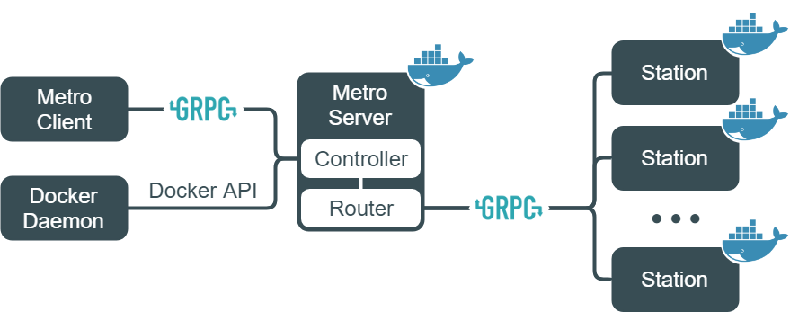
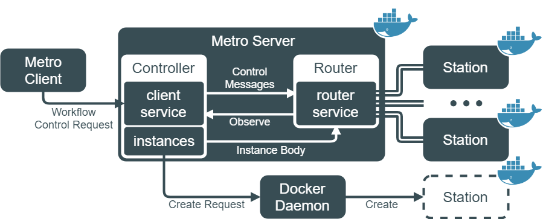
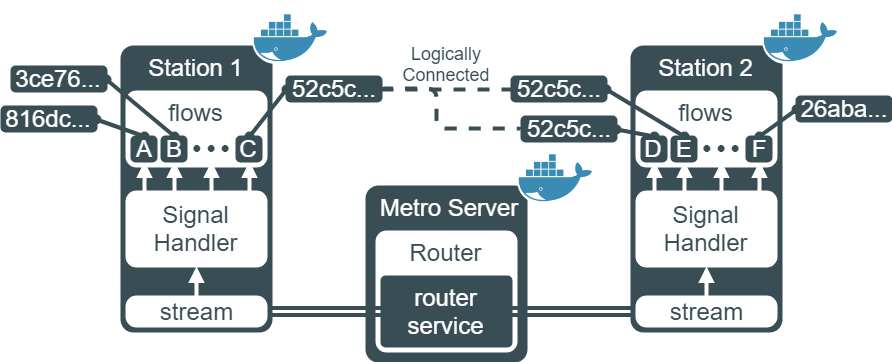

Metro
=====

Deploy workflows without any configuration.
The activity is written in code, and the next steps in the workflow are also represented in code.
Metro exposes the most basic "message transfer" method that has been abstracted from an existing workflow, allowing users to create complex and diverse workflows as they come to mind.

Table of Contents
=================

- [Metro](#metro)
- [Table of Contents](#table-of-contents)
- [Motivation](#motivation)
- [Getting Started](#getting-started)
  - [Prerequisites](#prerequisites)
  - [Installation](#installation)
  - [Run Metro Server](#run-metro-server)
  - [Start Workflow](#start-workflow)
- [Architecture](#architecture)
  - [Metro Server](#metro-server)
    - [Controller](#controller)
    - [Router](#router)
  - [Station](#station)

Motivation
==========

With the advent of serverless computing, the size of microservices has been shrunk to function units, and now we need to combine small functions to form a workflow.
For this, Amazon provides Step Functions, Azure provides Durable Functions, and IBM Cloud provides Composer.
All three offer different workflow programming models, but behind the scenes are actually sending and receiving messages.
Metro exposes the method to send and receive messages to the surface, and the user can model the workflow that the user is aiming for.

At Metro, the activity is more than a function, it has grown up again as a service, a microservice.
Furthermore, of course, activities can also sustain its state during the workflow runtime.

Check out the ping-pong example written in [Node.js v8](examples/pingpong/node/) or [Go v1.11](examples/pingpong/go/) and start Metro.

Getting Started
===============

## Prerequisites

- [Go](https://golang.org/doc/install) >= 1.11
- [Docker](https://docs.docker.com/install/linux/docker-ce/ubuntu/) >= 1.39
- Tested OSes
  - Ubuntu 18.04.2 LTS (Bionic Beaver)
  - macOS 10.14.2 Mojave

## Installation

```sh
# Download Metro server.
docker pull lokomotes/metro-server

# Download Metro client.
go get -u github.com/lokomotes/metro/cmd/metro

# Make sure the Metro client is downloaded.
# If the `metro --help` doesn't work, you might need to add $GOPATH/bin to your $PATH.
metro --help

# Download Station(activity runtime) for Node.js v8.
docker pull lokomotes/metro-station-node8
```

## Run Metro Server
```sh
# Add docker network for Metro server.
docker network create metro

# Run Metro server.
docker run -it --rm --network=metro \
    -v /var/run/docker.sock:/var/run/docker.sock \
    --publish 50051:50051 \
    --name metro \
    lokomotes/metro-server:latest serve
```

## Start Workflow
```sh
# Download ping-pong example.
curl -OL https://raw.githubusercontent.com/lokomotes/metro/master/examples/pingpong/node/\{pinger.js,ponger.js\}

# Create `pinger` and `ponger` activity.
# Metro provide Node.js v8 and Go v1.11 as runtime.
metro create pinger.js
metro create ponger.js

# Start ping-pong workflow.
# The entry point is `pinger:latest` with name `hello`.
# The `2` is passed to `pinger:latest~hello` as arguments.
# So it will play ping-pong twice.
metro start pinger:latest~hello 2
```
Each activity runs in a container and is slow to start since it is Cold for the first time.
You can prepare the Station by running the following command:
```sh
metro load pinger:latest
```

After `metro start pinger:latest~hello`, Metro server will show various logs.
A description of each log and `pinger:latest` can be found [here](examples/pingpong/node/DESCRIPTION.md).

Currently, the metro does not turn off the Station, that means containers are not removed automatically.
You should remove containers by running the following command:
```sh
docker rm $(docker ps -a -q)
```

Architecture
============

*<p align="center">Architecture Overview</p>*

## Metro Server



### Controller

The Controller provides client service and manages client instances, the containers that belong to the Metro.
Variable `instances` is a Map that image name is the key and `instance body` is the value.
The `instance body` holds its container ID and a GRPC write stream that connected to Station.
When a client requests the start of a workflow for an uninitialized instance, the Controller creates a container through docker daemon and stores the container ID and the buffer for this container in the instances.
The control messages such as START or TERM are generated from the Controller according to client request and forwarded through the Router.


### Router

Router provides router service that forwards messages from the Stations to the Stations. 
Each of the Stations is connected to Metro server via GRPC stream.
The Station requests router service with `token` that represents container ID, and the Router can obtain `instance descriptor` using  `token`.
For obtain destination stream, the Router fetches `instance body` from `instances` using `instance descriptor` and pushes messages to be forwarded through the stream.

## Station



Each of the Stations has a GRPC read `stream` that connected to router service of Metro server.
The `flows` manages activity instances that can be distinguished by flow ID and name.
Since messages hold flow ID and name of destination, signal handler reads messages from the read `stream`, forwards it to a correct activity instance.
Therefore, an activity instance can only communicate with an instance with the same flow ID.
In some workflows, there can be multiple instances of the same task activity.
The name is used for that case (see activity instance D and E in Station 2).